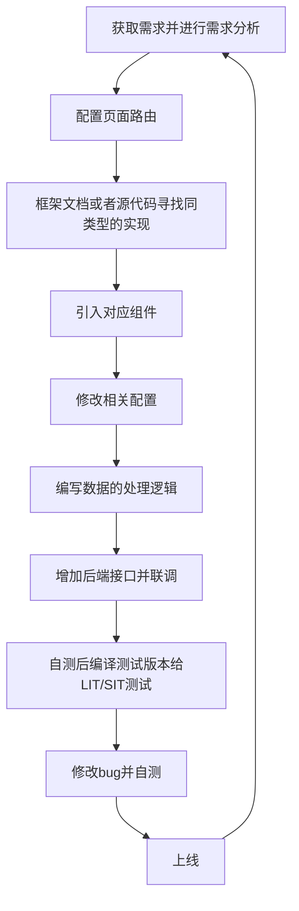

[TOC]


## 一、项目分析

| item       | 描述                                                         | 其他 |
| ---------- | ------------------------------------------------------------ | ---- |
| 背景       | 1.学生们要进行理化生考试<br />2.老师要对理化生考试的前、中、后期做准备，线下没那么方便<br />将上面的两种场景改为线上的 |      |
| 功能       | 1.对学生而言：可以在线考试、补考、对考试进行自评等操作<br />2.对老师而言：设置考卷、考场、监考、阅卷、评分等操作<br />3.对于学校而言：对老师、学生、教师的数量、出入、配置进行管理 |      |
| 竞争力分析 | 1.该项目比较吃销售，先讲故事，讲好故事之后能营销出去大概率就能做出来<br />2.市面上已经有很多个同类产品了，我们做出来的产品显得竞争力不是很足 |      |
| 项目难度   | 总分五颗星，开发难度2颗星；从0搭建的话4颗星。不难的主要原因是因为所有的实现都能找到例子，如果在没有例子的情况下，难度能上升到3颗星 |      |

## 二、技术栈

主要技术栈

| 技术          | 作用                                             | 备注                         |
| ------------- | ------------------------------------------------ | ---------------------------- |
| ruoyi管理系统 |                                                  |                              |
| vue2          | 单页面开发                                       |                              |
| pnpm          | 用于包管理                                       |                              |
| monorepo      | 用于管理多个项目<br />提高方法、配置的可复用性能 | 这个的搭建过程自己还不是很会 |
| axios         | 更多的是使用request和response进行网络请求和响应  | 1.如何进一步封装我是不太会   |
| eslint        | 用于代码扫描和检测                               |                              |
| less/sass     | css模块化工具                                    |                              |
| vuex          | 用于状态管理                                     |                              |
| vue-router    | 用于路由跳转                                     |                              |
| echarts       | 用于表格设计                                     |                              |

<details>
  <summary>pakage.js中能体现所有的使用的技术，详情可看：</summary>
  <div>
      '{                                                                    <br>
  "name": "vue-antd-pro",                                            <br>
  "version": "3.0.2",                                                <br>
  "private": true,                                                   <br>
  "scripts": {                                                       <br>
    "serve": "vue-cli-service serve:prehandle",                      <br>
    "build": "vue-cli-service build",                                <br>
    "test:unit": "vue-cli-service test:unit",                        <br>
    "lint": "vue-cli-service lint",                                  <br>
    "build:preview": "vue-cli-service build --mode preview",         <br>
    "lint:nofix": "vue-cli-service lint --no-fix",                   <br>
    "deploy": "node deploy/deploy.js",                               <br>
    "ci": "node deploy/auto-ci.js"                                   <br>
  },                                                                 <br>
  "vuePlugins": {                                                    <br>
    "service": [                                                     <br>
      "serve.prehandle.js"                                           <br>
    ]                                                                <br>
  },                                                                 <br>
  "dependencies": {                                                  <br>
    "@ant-design-vue/pro-layout": "^1.0.8",                          <br>
    "@antv/data-set": "^0.10.2",                                     <br>
    "@fullcalendar/core": "^5.10.1",                                 <br>
    "@fullcalendar/daygrid": "^5.10.1",                              <br>
    "@fullcalendar/interaction": "^5.10.1",                          <br>
    "@fullcalendar/timegrid": "^5.10.1",                             <br>
    "@fullcalendar/vue": "^5.10.1",                                  <br>
    "@riophae/vue-treeselect": "0.4.0",                              <br>
    "@wangeditor/editor": "^5.1.23",                                 <br>
    "@wangeditor/editor-for-vue": "^1.0.2",                          <br>
    "ant-design-vue": "^1.7.6",                                      <br>
    "axios": ">=0.21.1",                                             <br>
    "chinese-lunar-calendar": "^1.0.1",                              <br>
    "core-js": "^3.26.0",                                            <br>
    "echarts": "^5.3.1",                                             <br>
    "enquire.js": "^2.1.6",                                          <br>
    "html2canvas": "^1.4.1",                                         <br>
    "jspdf": "^2.5.1",                                               <br>
    "jszip": "^3.10.1",                                              <br>
    "lodash.clonedeep": "^4.5.0",                                    <br>
    "lodash.get": "^4.4.2",                                          <br>
    "lodash.pick": "^4.4.0",                                         <br>
    "md5": "^2.2.1",                                                 <br>
    "mockjs2": "1.0.8",                                              <br>
    "moment": "^2.24.0",                                             <br>
    "nprogress": "^0.2.0",                                           <br>
    "pixi.js": "^7.2.4",                                             <br>
    "store": "^2.0.12",                                              <br>
    "terser-webpack-plugin": "4",                                    <br>
    "vconsole": "^3.15.1",                                           <br>
    "video.js": "^7.18.1",                                           <br>
    "videojs-contrib-hls": "^5.15.0",                                <br>
    "videojs-markers": "^1.0.1",                                     <br>
    "viser-vue": "^2.4.6",                                           <br>
    "vue": "^2.6.14",                                                <br>
    "vue-clipboard2": "^0.2.1",                                      <br>
    "vue-cropper": "0.4.9",                                          <br>
    "vue-i18n": "^8.17.4",                                           <br>
    "vue-print-nb": "^1.7.5",                                        <br>
    "vue-quill-editor": "^3.0.6",                                    <br>
    "vue-router": "^3.5.2",                                          <br>
    "vue-svg-component-runtime": "^1.0.1",                           <br>
    "vuex": "^3.1.1"                                                 <br>
  },                                                                 <br>
  "devDependencies": {                                               <br>
    "@ant-design/colors": "^3.2.1",                                  <br>
    "@babel/preset-modules": "^0.1.6",                               <br>
    "@vue/cli-plugin-babel": "^4.0.4",                               <br>
    "@vue/cli-plugin-eslint": "^4.0.4",                              <br>
    "@vue/cli-plugin-router": "^4.0.4",                              <br>
    "@vue/cli-plugin-unit-jest": "^4.0.4",                           <br>
    "@vue/cli-plugin-vuex": "^4.0.4",                                <br>
    "@vue/cli-service": "^4.0.4",                                    <br>
    "@vue/eslint-config-standard": "^4.0.0",                         <br>
    "@vue/test-utils": "^1.0.0-beta.29",                             <br>
    "archiver": "^5.3.1",                                            <br>
    "babel-eslint": "^10.0.1",                                       <br>
    "babel-plugin-import": "^1.12.2",                                <br>
    "babel-plugin-transform-remove-console": "^6.9.4",               <br>
    "eslint": "^5.16.0",                                             <br>
    "eslint-plugin-html": "^5.0.0",                                  <br>
    "eslint-plugin-vue": "^5.2.3",                                   <br>
    "git-revision-webpack-plugin": "^3.0.6",                         <br>
    "less": "^3.7.0",                                                <br>
    "less-loader": "^5.0.0",                                         <br>
    "node-ssh": "^13.0.1",                                           <br>
    "sass": "1.32.13",                                               <br>
    "sass-loader": "10.1.1",                                         <br>
    "vue-svg-icon-loader": "^2.1.1",                                 <br>
    "vue-template-compiler": "^2.6.14",                              <br>
    "webpack-bundle-analyzer": "^4.9.1",                             <br>
    "webpack-theme-color-replacer": "^1.3.12"                        <br>
  }                                                                  <br>
}'
    </div>
</details>

## 三、其他分析

|          | 描述                                                         | 其他 |
| -------- | ------------------------------------------------------------ | ---- |
| 人数     | 前端4人                                                      |      |
| 时间     | 20240402-20240430                                            |      |
| 项目亮点 | 1.多个项目并行，使用monorepo进行多项目管理。提升了代码复用率<br />2.许多组件重复出现，进行共有组件、指令、方法的提取和复用<br />3.video.js按颜色进行视频打点<br />4.tts语音播报 |      |
| 项目收获 | 1.熟练使用rouyi项目进行开发<br />                            |      |
| 创新思路 | 1.实现一个页面的多次复用：抽取公用字段/html之类的            |      |

## 四、项目部分图例

### 例子1：课程表以及课程安排


日历实现：‘<a-calendar>’

抽屉实现：‘<a-drawer>’

表格实现：‘<a-descriptions>’  + '<a-descriptions-item>'去实现右侧表格

路由实现：

```vue
        <a-card :bordered="false">
      <a-menu mode="horizontal" :selectedKeys="selectedKeys" type="inner">
        <a-menu-item key="/academic/task/myClassSchedule">
          <router-link :to="{ name: 'taskMyClassSchedule' }"> 我的课程 </router-link>
        </a-menu-item>
        <a-menu-item key="/academic/task/drawMgt">
          <router-link :to="{ name: 'taskDrawMgt' }"> 我的抽签 </router-link>
        </a-menu-item>
        <a-menu-item key="/academic/task/invigilationMgt">
          <router-link :to="{ name: 'taskInvigilationMgt' }"> 我的监考 </router-link>
        </a-menu-item>
      </a-menu>
      <div class="account-settings-info">
        <route-view></route-view>
      </div>
    </a-card>	
```

### 例子2：点击对应的颜色评分块儿，跳转到对应进度条


功能难点：

1.将进度条上面的颜色和评分标准对应起来，用户点击评分标准的时候能够跳转到对应的进度条条上面去

实现：

1. 用[video.js](https://docs.videojs.com/errordisplay#event:dispose)框架去实现的视频播放，将video播放抽象成单独的路由
2. 将需要的参数配置通过props传递到子路由，videojs-markers实现视频打点。[使用方法](https://blog.csdn.net/prompt1_9/article/details/130827476)
3. 父组件接收后端传递的数据并进行处理，增加点击时的处理逻辑

### 例子3：内存监控页面


### 例子4：分数统计


### 例子5：考试任务下发


## 五、原理分析

1.视频打点的原理是什么呢？

本质上是从后台获取到的时间点后，在渲染的时候给每一段长度（‘-data-percent’）添加不同的颜色样式，点击的时候调用video的播放按钮跳转到特定的时间点

2.为什么要用this.$ref.set(xxx)

因为object.defineproperty无法监听到对象的添加和删除。所以需要使用这个去动态改变对象。

## 六、总结

1.主要是使用anti-design框架内部的内容去实现，element-ui或者其他框架同理，主要看文档就可以

2.常用的组件是：下拉框、输入框、表格、查询、文件下载、文件导入，项目功能本质是通过路由在这些组件之间反复嵌套和使用

3.ruoyi开发流程分析：


